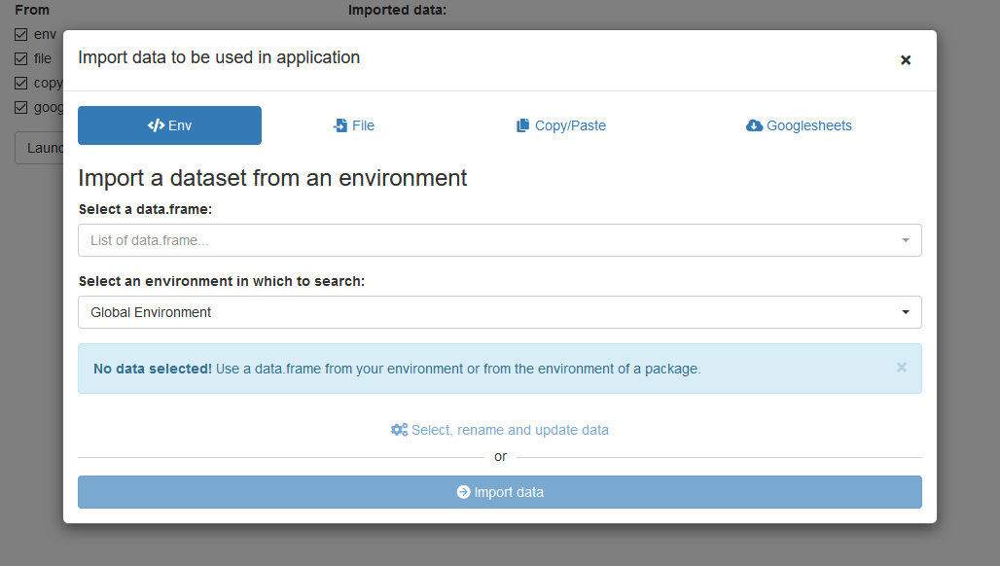
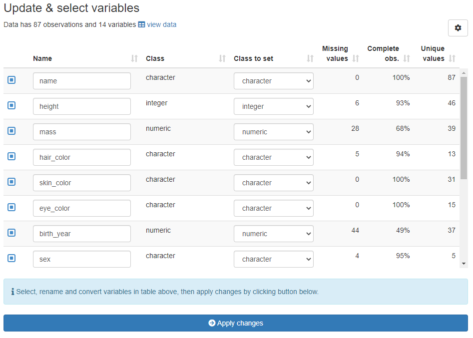

<!-- README.md is generated from README.Rmd. Please edit that file -->

# datamods

> Shiny modules to import and manipulate data into an application or
> addin.

<!-- badges: start -->

[](https://CRAN.R-project.org/package=datamods)
[](https://app.codecov.io/gh/dreamRs/datamods)
[](https://cran.r-project.org/package=datamods)
[](https://github.com/dreamRs/datamods/actions/workflows/R-CMD-check.yaml)
<!-- badges: end -->

### Overview

This package provides custom shiny modules to import data from various
sources, select, rename and convert variables in a dataset and validate
content with [validate](https://github.com/data-cleaning/validate)
package.  
The modules can be used in any standard shiny application or RStudio
add-in.

### Internationalization

Currently you can use {datamods} in the following language:

english (default),

french,

macedonian,

brazilian portuguese,

albanian,

chinese,

spanish,

german,

turkish,

korean.

If you want another language to be supported, you can submit a Pull
Request to add a CSV file like the one used for french (file is located
in `inst/i18n` folder in the package, you can see it [here on
GitHub](https://github.com/dreamRs/datamods/blob/master/inst/i18n/fr.csv)).

See the [online
vignette](https://dreamrs.github.io/datamods/articles/i18n.html) for
more on this topic.

### Installation

Install from [CRAN](https://CRAN.R-project.org/package=datamods) with:

``` r
install.packages("datamods")
```

You can install the development version of datamods from
[GitHub](https://github.com/dreamRs/datamods) with:

``` r
remotes::install_github("dreamRs/datamods")
```

### Import

Import data from:

-   **environment**: such as Global environment or from a package
-   **file**: text files, Excel, SAS or SPSS format… anything that
    package [rio](https://github.com/leeper/rio) can handle
-   **copy/paste**: paste data from an other source like Excel or text
    file
-   **Google Sheet**: use the URL to import the Googlesheet
-   **URL**: use a URL to import from a flat table

Each module is available in the form `import_file_ui()` /
`import_file_server()` and can be use independently.

Or all modules can be launched together in a modal window via
`import_modal()` / `import_server()`:



This module also allow to view imported data and to update variables.

### Update

Module `update_variables_ui()` / `update_variables_server()` allow to:

-   **select** variables of interest in a dataset
-   **rename** variables to be used in application after that
-   **convert** variables to change their class, from character to
    numeric for example



### Validate

Define some validation rules with package
[validate](https://github.com/data-cleaning/validate) and check whether
data lives up to those expectations.


### Filter

Interactively filter a `data.frame`, this module also generates the code
to reproduce the filters.


### Sample

Interactively sample a `data.frame`:


