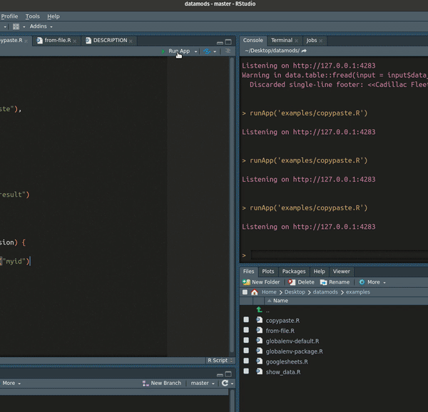

```{r, include = FALSE}
knitr::opts_chunk$set(
  collapse = TRUE,
  comment = "#>"
)
```

```{r setup}
library(datamods)
```

When working with shiny, uploading data is a bit of a hassle. There are a number of
corner cases one has to be mindful of. For example:  

* checking that the uploaded file is of the correct format  

* checking if R can load the file

* while dealing with excel files, providing an option to choose the sheet number.  

* while using googlesheets, the hassle of authentication and stuff.

The {datamods} package helps to easily load and use data in shiny apps with the
help of modules.  
There are 5 modules that can load data from various different sources.
The modules with a short intro are described below

## Modules in datamods

### `import-globalenv`
Imports data from the global environment. 
It searches for data sets in the global environment and lets the user choose
the data to use.

### `import-file`
Imports data from an external file. 
The file can be of any format, csv, xlsx, tsv etc.
In case of excel files, it gives an option to choose the sheet.  

### `import-copypaste`
Imports data via copy/paste. 
Simply copy and paste data from any source.

### `import-googlesheets`
Imports data from googlsheets.  
If the googlesheet is publicly shared, then no authentication is required.
Simply pasting the link will import the data.  
If it is not publicly shared, option is given to the user to authenticate.

### `import-database`
imports data from databases.  


## Integrating with shiny

Let's see how one can integrate a {datamods} module in a shiny app.  

There are two main functions. `import_*_ui` & `import_*_server` for ui and server
respectively.  

For example, let us consider the module `import-file`. It has the two functions
as `import_file_ui` & `import_file_server`.  

One just needs to plug these two functions in the right place, as below.  


```{r}
library(shiny)
library(datamods)

ui <- fluidPage(
  tags$h3("Import data from a file"),
  fluidRow(
    column(
      width = 4,
      import_file_ui("myid")  #> this is the ui module
    ),
    column(
      width = 8,
      tags$b("Imported data:"),
      tableOutput(outputId = "result")
    )
  )
)

server <- function(input, output, session) {
  
  imported <- import_file_server("myid") #> this is the server module
  
  output$result <- renderTable({
    imported$data()
  })
  
}

if (interactive())
  shinyApp(ui, server)
```

**Note:** the import_*_server functions return a `reactiveValues` object. So its
best to assign the server call to a variable. In the example above, this is done
by `imported <- import_file_server("myid")`  

The data can then be accessed with `imported$data()`  

## An example: `import-copypaste`

Below is an example of a datamods module(`import-copypaste`) in action.

{width=710px}


