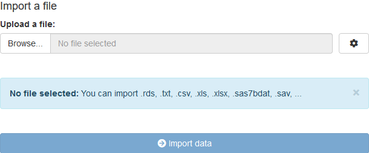
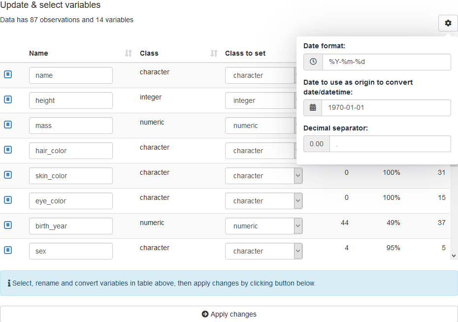
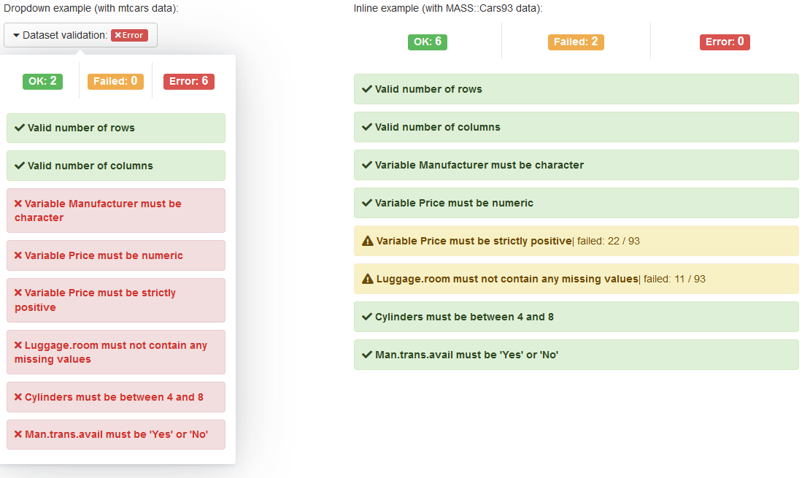
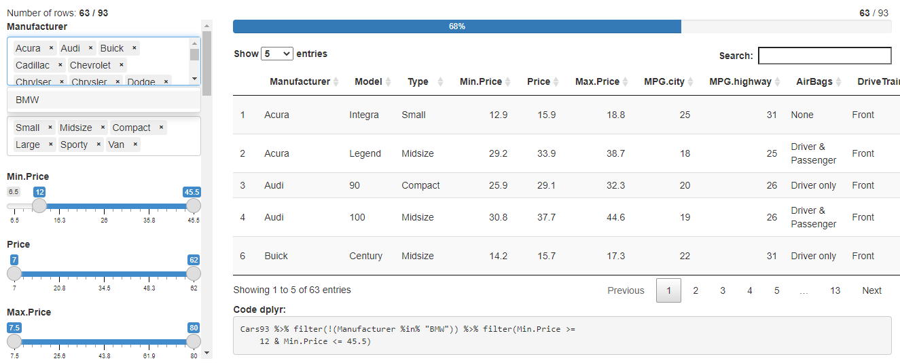
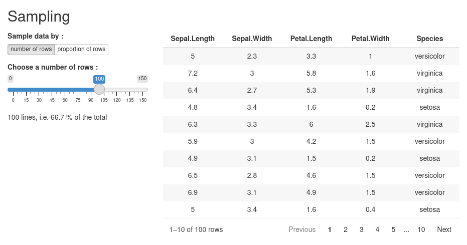

```{r, include = FALSE}
knitr::opts_chunk$set(
  collapse = TRUE,
  comment = "#>",
  eval = FALSE
)
```

```{r setup}
library(datamods)
```


The {datamods} package contains modules to work with data in Shiny application, currently the following modules are implemented :

* Import modules : import data from various sources
* Update table structure: select columns to keep, rename variable and convert from a class to anoter (e.g. numeric to character)
* Filter data : interactively filter a `data.frame`
* Validate : check that data respect some expectations (with [package {validate}](https://cran.r-project.org/package=validate))
* Sample data: interactively sample a `data.frame`.


## Import

### From environment

Imports data from the user's global environment or a package environment to retrieve included in it. 
It searches for data sets in the global environment and lets the user choose the data to use.

```{r}
# UI
import_globalenv_ui("myid")

# Server
imported <- import_globalenv_server("myid")
```

</img>


### From file

Imports data from an external file. The file can be of any format, csv, xlsx, tsv etc.. Import is performed by package [rio](https://github.com/gesistsa/rio).
In case of Excel files, it gives an option to choose the sheet. 

```{r}
# UI
import_file_ui("myid")

# Server
imported <- import_file_server("myid")
```

</img>


### From clipboard

Imports data via copy/paste. Simply copy and paste data from any source.

```{r}
# UI
import_copypaste_ui("myid")

# Server
imported <- import_copypaste_server("myid")
```

</img>


### From Googlesheet

Imports data from a Googlesheet. Use the shareable link to read data.

```{r}
# UI
import_googlesheets_ui("myid")

# Server
imported <- import_googlesheets_server("myid")
```

</img>

### From URL

Imports data from a URL. Only flat data in any format supported by [package rio](https://CRAN.R-project.org/package=rio/vignettes/rio.html#Supported_file_formats).

```{r}
# UI
import_url_ui("myid")

# Server
imported <- import_url_server("myid")
```


### Usage

All modules are used in the same way in a Shiny application, here is an example:

```{r}
library(shiny)
library(datamods)

ui <- fluidPage(
  tags$h3("Import data with copy & paste"),
  fluidRow(
    column(
      width = 4,
      import_copypaste_ui("myid")
    ),
    column(
      width = 8,
      tags$b("Imported data:"),
      verbatimTextOutput(outputId = "status"),
      verbatimTextOutput(outputId = "data")
    )
  )
)

server <- function(input, output, session) {

  imported <- import_copypaste_server("myid")

  output$status <- renderPrint({
    imported$status()
  })
  output$data <- renderPrint({
    imported$data()
  })

}

shinyApp(ui, server)  
```

All modules have the same return value server-side, a `list` with three slots:

* **status**: a `reactive` function returning the status: `NULL`, `error` or `success`.
* **name**: a `reactive` function returning the name of the imported data as `character`.
* **data**: a `reactive` function returning the imported `data.frame`.


### Modal Window

All modules can be launched at once in a modal window:

</img>


Launch the modal server-side with:

```{r}
observeEvent(input$launch_modal, {
  import_modal(
    id = "myid",
    title = "Import data to be used in application"
  )
})
```

See `?import_modal` for a complete example.


## Update Modules

This module allow to dynamically select, rename and convert variables of a dataset.

</img>


Some options for converting to date and numeric are available in a dropdown menu.

Return value of the module is a `reactive` function with the update data.


## Validate

When importing data into an application it can be useful to check that data respect some expectations: number of rows/columns, existence of a variable, ... This module allow to validate rules defined with package [validate](https://github.com/data-cleaning/validate).

```{r}
# UI
validation_ui("validation", display = "inline")

# Server
results <- validation_server(
  id = "validation",
  data = dataset,
  n_row = ~ . > 20, # more than 20 rows
  n_col = ~ . >= 3, # at least 3 columns
  rules = myrules
)

# Rules are defined as follow:
myrules <- validator(
  is.character(Manufacturer) | is.factor(Manufacturer),
  is.numeric(Price),
  Price > 12, # we should use 0 for testing positivity, but that's for the example
  !is.na(Luggage.room),
  in_range(Cylinders, min = 4, max = 8),
  Man.trans.avail %in% c("Yes", "No")
)
# Add some labels
label(myrules) <- c(
  "Variable Manufacturer must be character",
  "Variable Price must be numeric",
  "Variable Price must be strictly positive",
  "Luggage.room must not contain any missing values",
  "Cylinders must be between 4 and 8",
  "Man.trans.avail must be 'Yes' or 'No'"
)
# you can also add a description()
```

</img>


Validation results can be displayed in a dropdown menu (above left) or inline where the module is called.

The return value server-side is a list with the following items:

* **status**: a reactive function returning the best status available between "OK", "Failed" or "Error".
* **details**: a reactive function returning a list with validation details.


## Filter

Interactively filter a `data.frame` and generate code to reproduce filters applied:

```{r}
# UI
filter_data_ui("filtering", max_height = "500px")

# Server
res_filter <- filter_data_server(
  id = "filtering",
  data = reactive(mtcars),
  name = reactive("mtcars"),
  vars = reactive(names(mtcars)),
  widget_num = "slider",
  widget_date = "slider",
  label_na = "Missing"
)
```

You can select variables for which to create a filter and choose widgets used to create the UI filter.

</img>

The return value server-side is a list with the following items:

* **filtered**: a `reactive` function returning the data filtered.
* **code**: a `reactive` function returning the dplyr pipeline to filter data.
* **expr**: a `reactive` function returning an expression to filter data.


## Sample

Interactively sample a `data.frame` to keep only part of the data, depending on the number or proportion of rows to keep.

```{r}
# UI
sample_ui("myID")

# Server
result_sample <- sample_server("myID", reactive(iris))
```

</img>


## Edit

Interactively edit a `data.frame`, this module also allow to :

* **adding**, **deleting** and **modifying** rows
* choosing **editable columns** and choosing **mandatory columns**
* **exporting data** (csv and Excel)


```{r}
# UI
edit_data_ui(id = "id")

# Server
  res_edited <- edit_data_server(
    id = "id",
    data_r = reactive(demo_edit),
    add = TRUE,
    update = TRUE,
    delete = TRUE,
    download_csv = TRUE,
    download_excel = TRUE,
    file_name_export = "datas",
    var_edit = c("name", "job", "credit_card_provider", "credit_card_security_code"),
    var_mandatory = c("name", "job")
  )
```

</img>


This module returns the edited table with the user modifications.
See ?demo_edit to see the data created for this data edit example.
